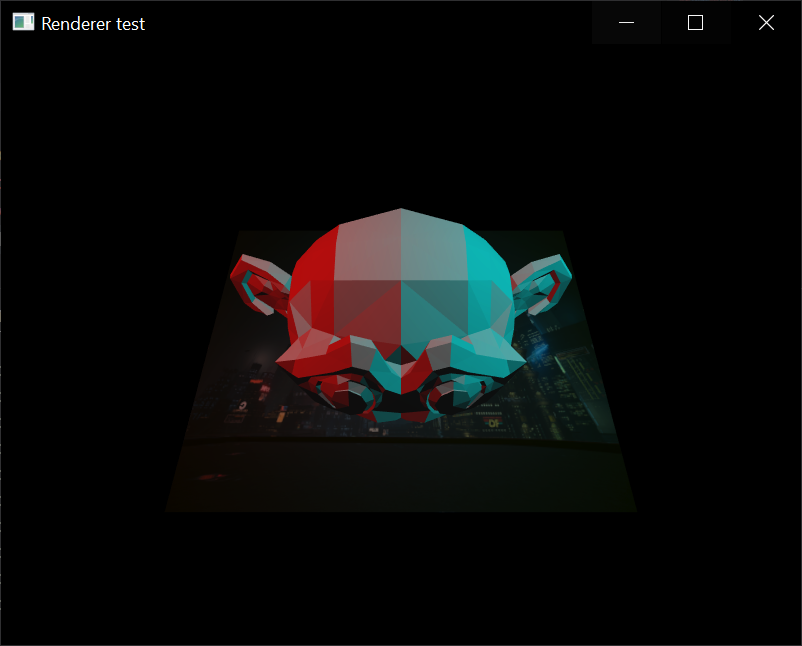

# Renderer
This is a 3D realtime rendering framework written in rust using the Vulkan API.

# Features
Only supports graphic subpasses

It currently supports multiple subpasses and render passes as long as they do
not depend on each other. 
I am currently rewriting that part of the code to support subpass and renderpass dependencies.

# Future plans
- Generating the `SubpassPiplineState`s using the frame graph currently being developped
- Adding support for instanced meshes
- Adding support for Compute operations
- Reducing the ammount of boilerplate required for a basic application
- Adding support for hardware Ray Tracing

# Screenshots
Screenshot from the example:

