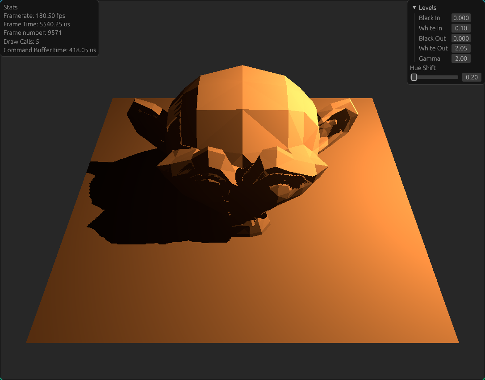

# Renderer
This is a 3D realtime rendering framework written in rust using the Vulkan API.

# Future plans
- Adding support for instanced meshes
- Reducing the ammount of boilerplate required for a basic application
- Adding support for hardware Ray Tracing

# Screenshots
Screenshot from the example:

